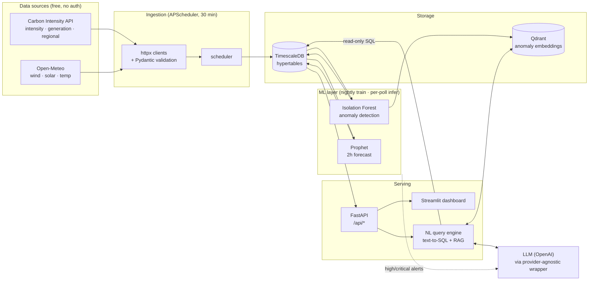

# ⚡ GridWatch

**A UK National Grid operational-intelligence platform** — it ingests live
electricity-grid data every 30 minutes, detects anomalies and forecasts the next
two hours with ML, serves it through a FastAPI backend and a Streamlit dashboard,
and adds a **conversational layer** so an operator can ask *"why did carbon
intensity spike last night?"* and get a grounded, SQL-backed answer.

The pattern — live operational data → anomaly detection → an LLM reasoning layer
over a conversational interface — is the same shape used by operational-intelligence
teams (Palantir, DAZN, Kraken/Octopus). GridWatch applies it to the GB grid.

---

## What it does

| Capability | How |
|---|---|
| **Live ingestion** | Carbon Intensity API + Open-Meteo, every 30 min, into TimescaleDB (90-day backfill on first run) |
| **Anomaly detection** | Isolation Forest per signal (intensity, wind %, forecast error, renewable %), severity-graded |
| **Forecasting** | Prophet — 2-hour-ahead intensity / wind / solar / renewable, with confidence bands |
| **REST API** | FastAPI: current state, time series, generation mix, regional snapshot, clean windows, anomalies |
| **Dashboard** | Streamlit — KPI cards, generation donut, 24h trend with anomaly overlays, forecast band, regional map |
| **NL query layer** | English → SQL → executed **read-only** → plain-English answer, grounded by RAG over past anomalies |

---

## Architecture



---

## Quickstart

**Prerequisites:** Docker + Docker Compose. An OpenAI API key (only needed for the
NL query layer and anomaly-explanation one-liners — everything else runs without it).

```bash
cp .env.example .env
# edit .env and set OPENAI_API_KEY=sk-...

docker compose up --build
```

On first run the ingestion service backfills 90 days of data, trains the ML models,
and seeds the anomaly index — this takes a couple of minutes. Then:

| Service | URL |
|---|---|
| Dashboard | http://localhost:8501 |
| Ask GridWatch (NL chat) | http://localhost:8501/Ask_GridWatch |
| API docs | http://localhost:8000/docs |
| Latest grid state | http://localhost:8000/api/grid/latest |

**Verify the data is clean:**
```bash
docker compose exec ingestion python tests/validate_data.py
```

**Try the NL layer end-to-end (22 sample questions):**
```bash
docker compose exec api python tests/test_nl.py
```

---

## The NL query layer (the interesting part)

Ask a question in English; the engine:

1. **Retrieves** similar past anomalies from Qdrant (semantic search) for context.
2. **Generates** a single SQL query from a schema- and domain-aware prompt.
3. **Executes it read-only** — validated to be a lone `SELECT`, run inside a
   `SET TRANSACTION READ ONLY` transaction with a statement timeout and row cap.
   Write/DDL attempts are rejected *and* impossible at the DB level (defense in depth).
4. **Explains** the result in plain English.

> **Q:** *"Why did carbon intensity spike yesterday evening?"*
> **A:** *"The spike was primarily due to high reliance on gas, which accounted for
> over 50% of the mix during peak hours; at 21:30 gas contributed 52% while wind and
> solar were low."*

The LLM sits behind a **provider-agnostic wrapper** (`llm/`) — swap OpenAI for
another provider with one env var, no code changes.

---

## Tech stack

**Python 3.11** · httpx · APScheduler · Pydantic · **TimescaleDB** (Postgres 15) ·
**Qdrant** · scikit-learn (Isolation Forest) · **Prophet** · pandas ·
**FastAPI** · SQLAlchemy · **Streamlit** · Plotly · **OpenAI** (chat + embeddings) ·
Docker Compose.

## Project layout

```
ingestion/   API clients, scheduler, DB writer
db/          SQLAlchemy engine + TimescaleDB schema/hypertables
models/      Pydantic schemas (API contract + DB records)
ml/          features, Isolation Forest, Prophet, alerts, train/detect
api/         FastAPI app + KPI query layer
dashboard/   Streamlit dashboard + Ask-GridWatch chat page
llm/         provider-agnostic LLM wrapper (chat + embeddings)
nl/          NL query engine: schema prompt, SQL guard, RAG, orchestration
tests/       API smoke, data validation, NL-layer suite
```

## Data sources

- **Carbon Intensity API** (`api.carbonintensity.org.uk`) — national intensity,
  generation mix, regional intensity, and a forward 48h forecast. No key.
- **Open-Meteo** (`api.open-meteo.com`) — hourly wind, solar radiation, temperature.
  No key. Note: historical archive is on `archive-api.open-meteo.com`.

## Deployment

See [DEPLOY.md](DEPLOY.md) for deploying to Railway. CI (lint · compile · docker
build) runs on every push via [GitHub Actions](.github/workflows/ci.yml).
